# AlphaGAN

    

This project is an unofficial implementation of [AlphaGAN: Generative adversarial networks for natural image matting](https://arxiv.org/pdf/1807.10088.pdf) published at the BMVC 2018. As for now, the result of my experiment is not as good as the paper's.

# Dataset

## Adobe Deep Image Matting Dataset

Follow the [instruction](https://sites.google.com/view/deepimagematting) to contact the author for the dataset

You might need to follow the method mentioned in the **Deep Image Matting** to generate the trimap using the alpha mat.

The trimap are generated while the data are loaded.

```python
import numpy as np
import cv2 as cv

def generate_trimap(alpha):
   k_size = random.choice(range(2, 5))
   iterations = np.random.randint(5, 15)
   kernel = cv.getStructuringElement(cv.MORPH_ELLIPSE, (k_size, k_size))
   dilated = cv.dilate(alpha, kernel, iterations=iterations)
   eroded = cv.erode(alpha, kernel, iterations=iterations)
   trimap = np.zeros(alpha.shape, dtype=np.uint8)
   trimap.fill(128)

   trimap[eroded >= 255] = 255
   trimap[dilated <= 0] = 0

   return trimap
```

The Dataset structure in my project

```Bash
Train
  ├── alpha  # the alpha ground-truth
  ├── fg     # the foreground image
  ├── input  # the real image composed by the fg & bg
MSCOCO
  ├── train2014 # the background image

```
# Differences from the original paper

- SyncBatchNorm instead of pytorch original BatchNorm when use multi GPU.

- Training batch_size = 1 [[1]](#ref1) [[2]](#ref2) 

- Using GroupNorm [[2]](#ref2)

- Using Warmup [[3]](#ref3) [[4]](#ref4)

# Records

4 GPUS 32 batch size, and SyncBatchNorm
- Achieved **SAD=78.22** after 21 epoches.

1 GPU 1 batch size, and GroupNorm
- Achieved **SAD=68.61** after 33 epoches.

# Results

| image | trimap | alpha(predicted) |
|:---:  | :--:   |      :---:       |
|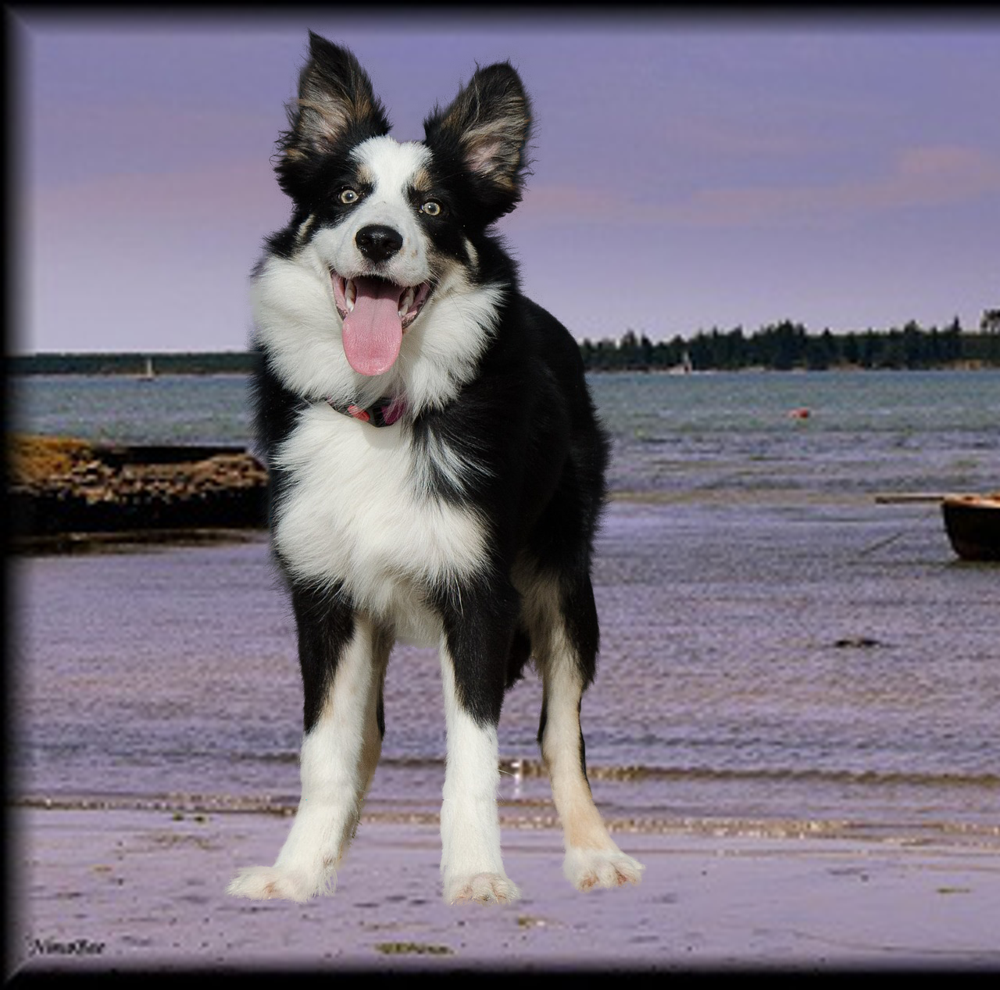| 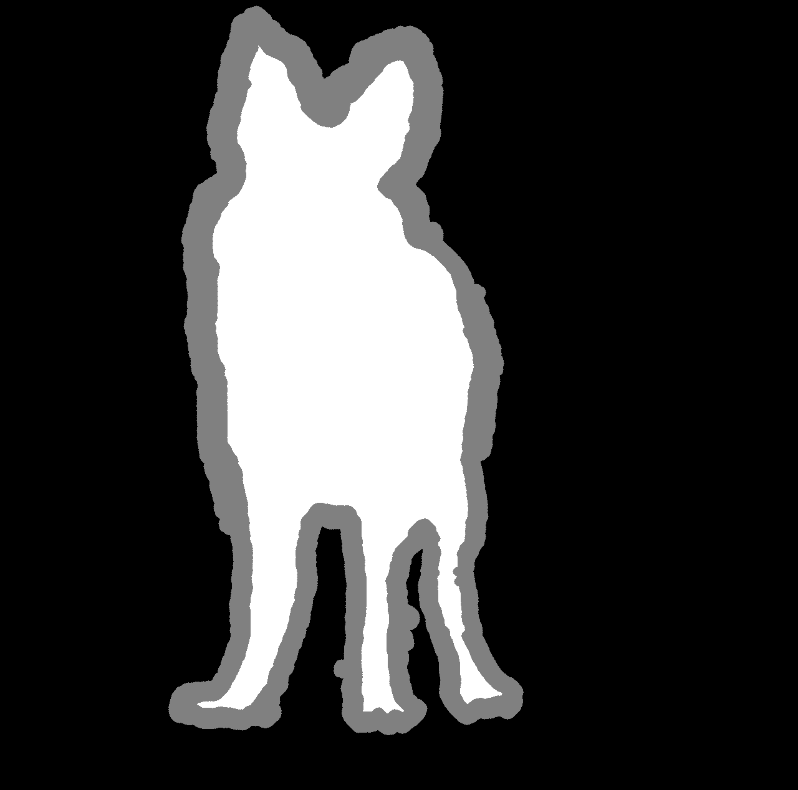| 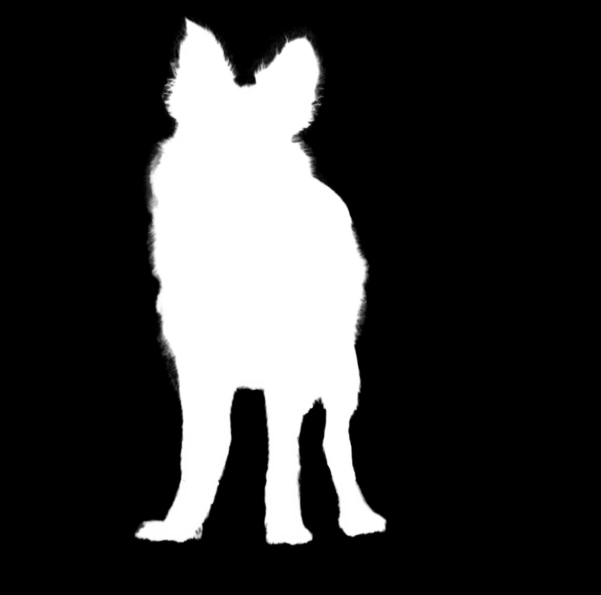|
|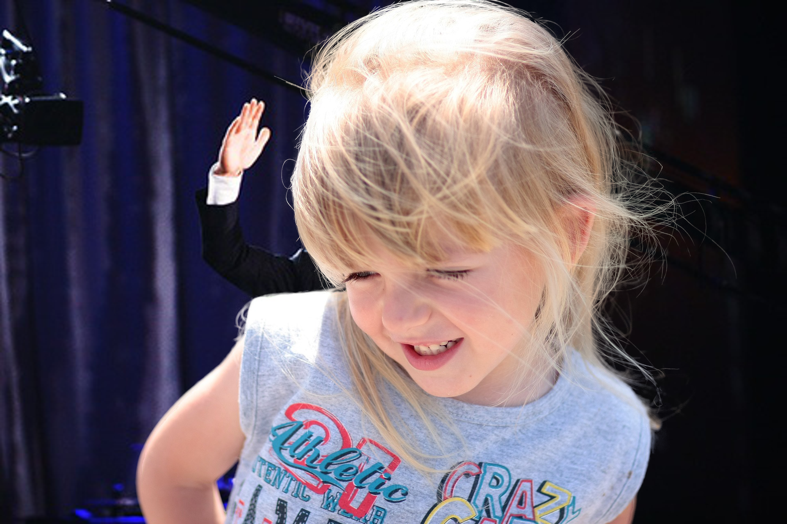| 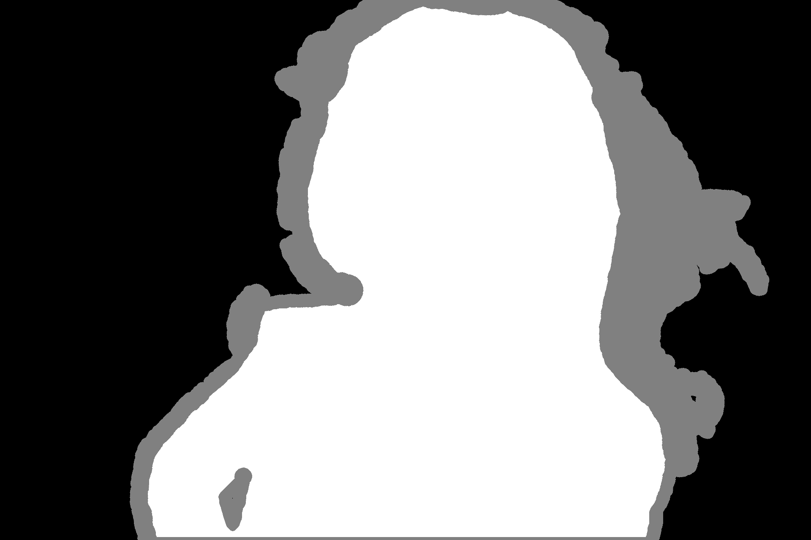| 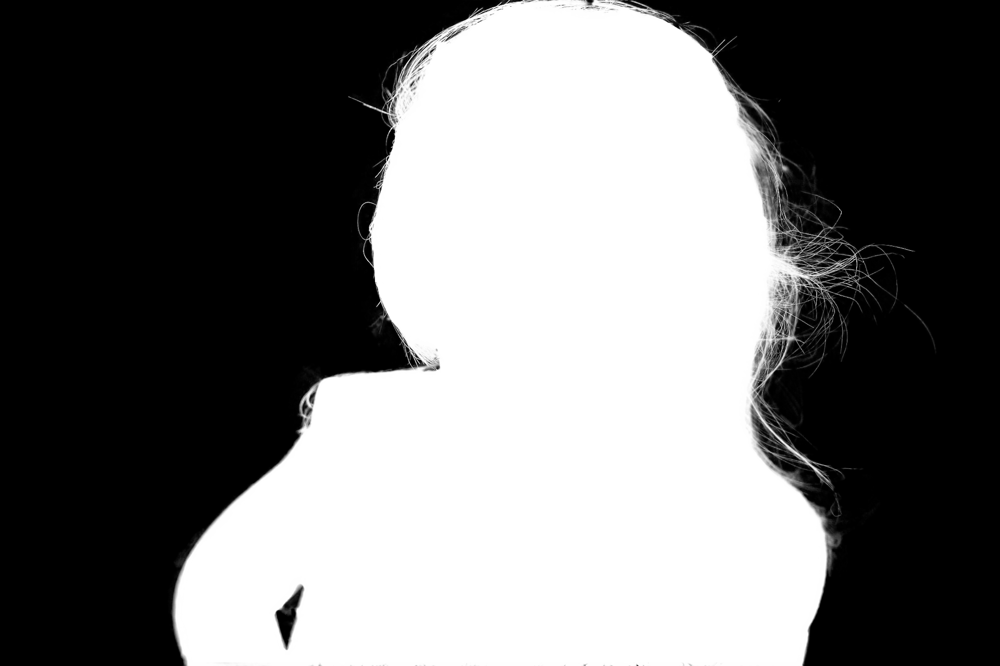|
|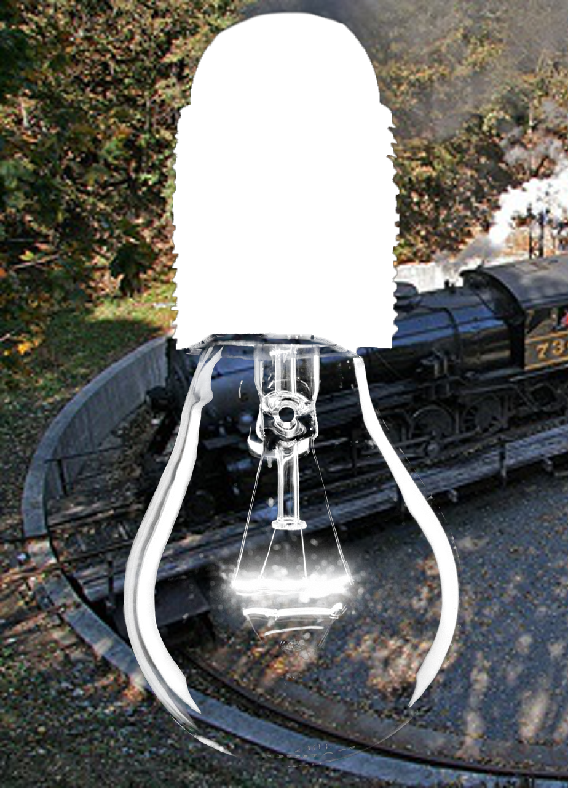|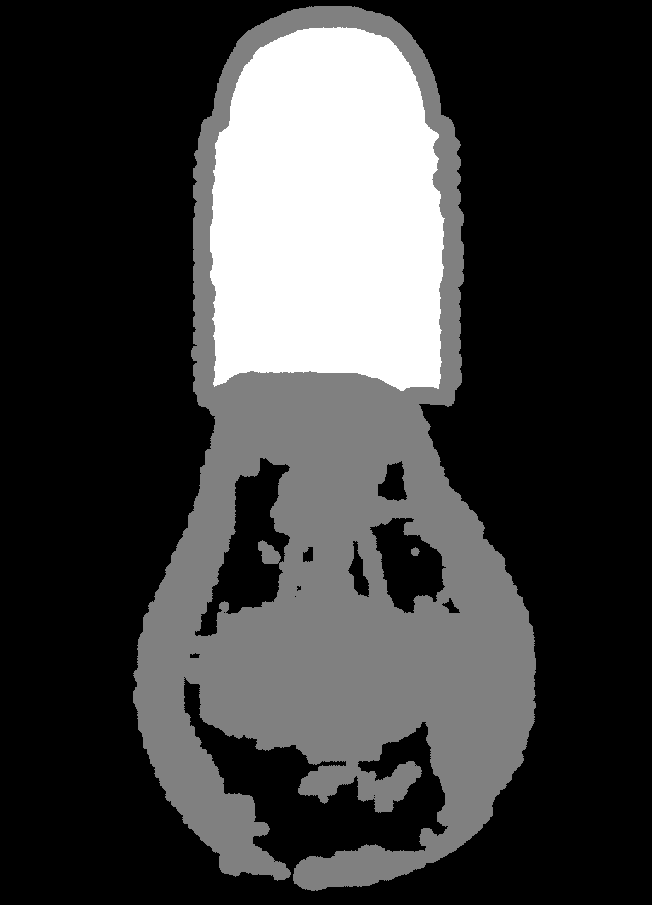|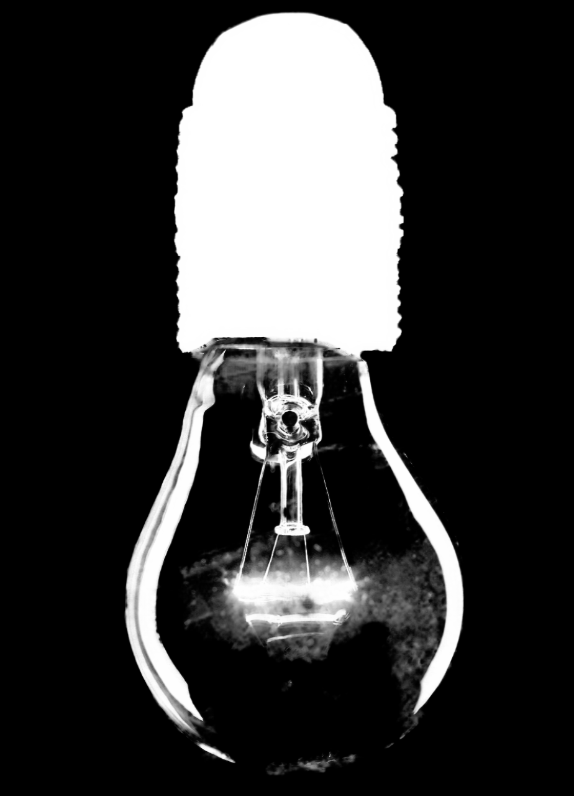|
||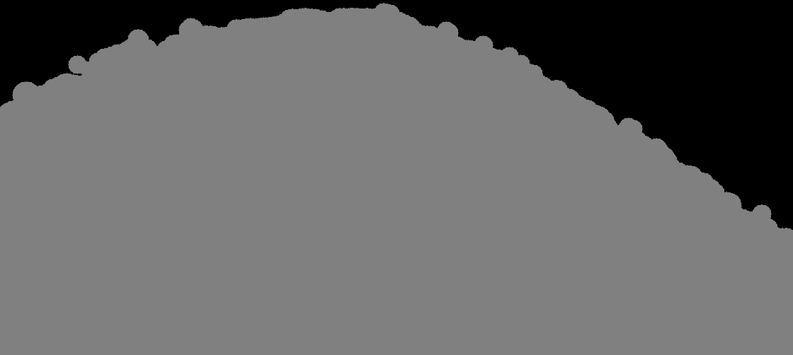|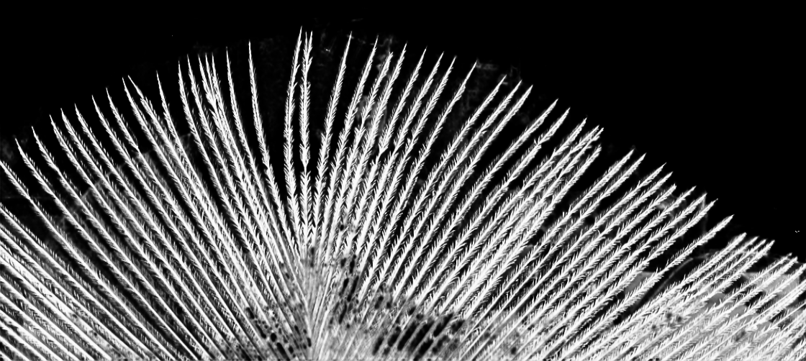|
|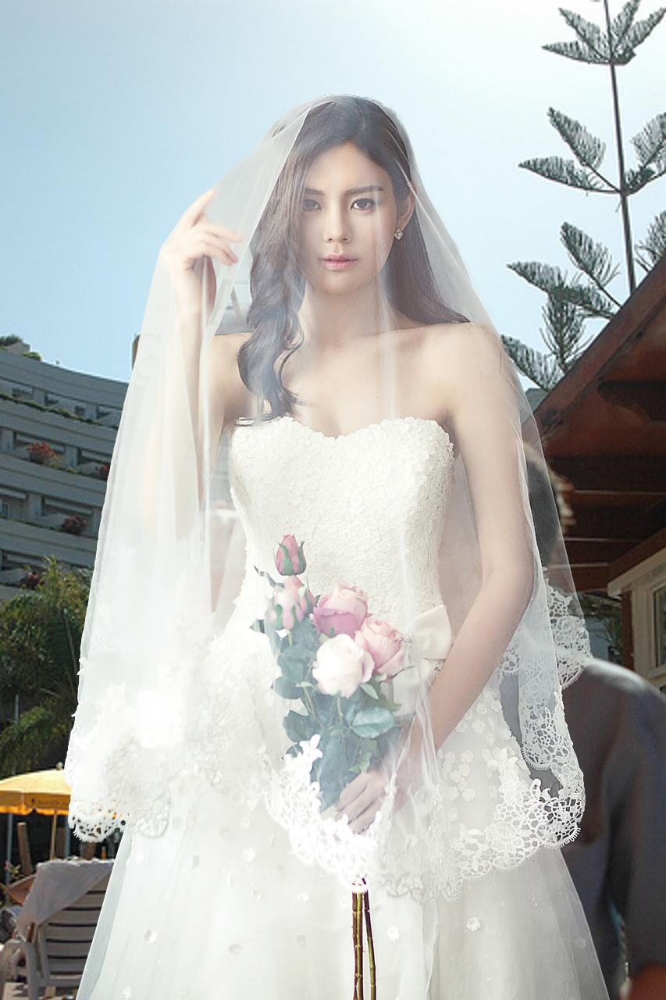|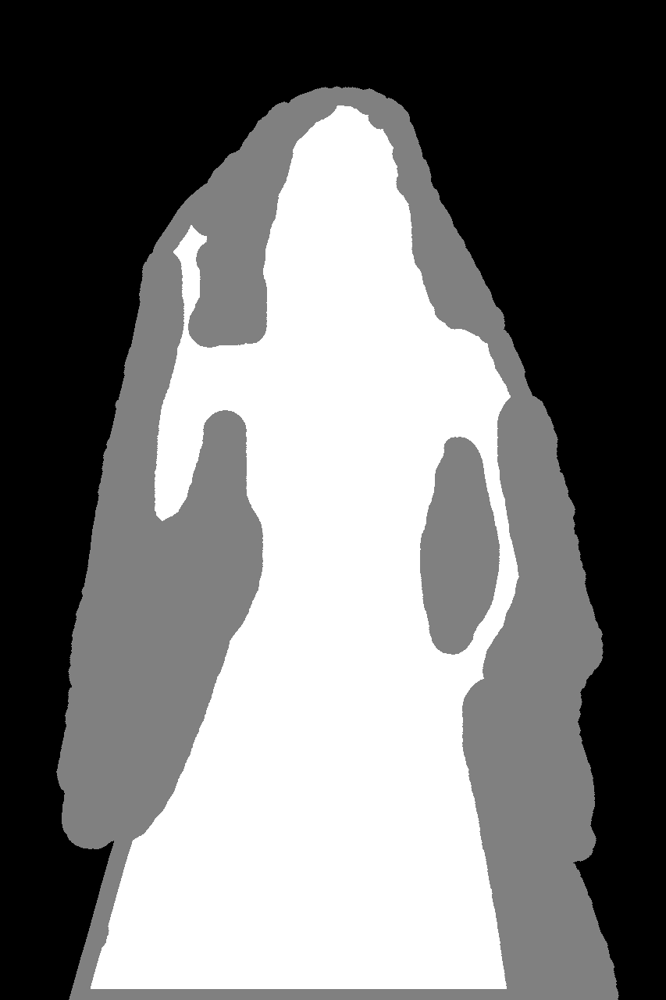|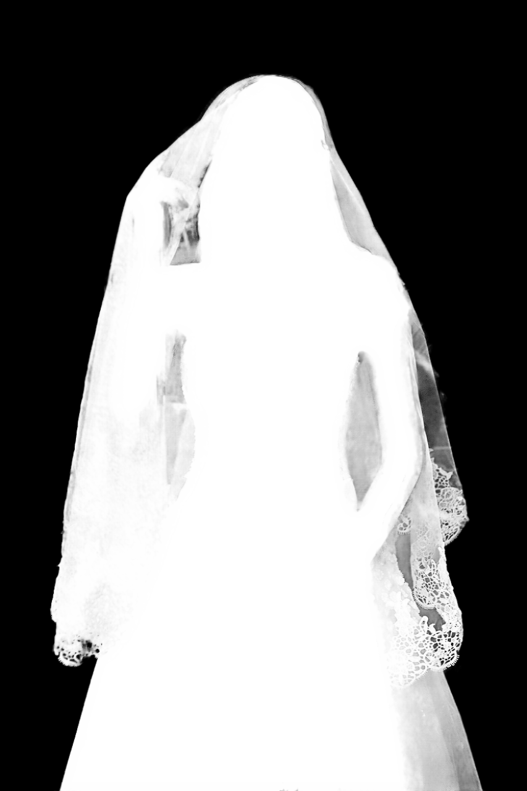|


# Acknowledgments

My code is inspired by:

- <span id="ref1"></span>  [1] [pytorch-deep-image-matting](https://github.com/huochaitiantang/pytorch-deep-image-matting)

- <span id="ref2"></span> [2] [FBA-Matting](https://github.com/MarcoForte/FBA-Matting)

- <span id="ref3"></span> [3] [GCA-Matting](https://github.com/MarcoForte/FBA-Matting)

- <span id="ref4"></span> [4] [reid-strong-baseline](https://github.com/michuanhaohao/reid-strong-baseline)

- [pytorch-CycleGAN-and-pix2pix](https://github.com/junyanz/pytorch-CycleGAN-and-pix2pix)

- [pytorch-book](https://github.com/chenyuntc/pytorch-book) chapter7 generate anime head portrait with GAN

- [pytorch-deeplab-xception](https://github.com/jfzhang95/pytorch-deeplab-xception)

- [indexnet_matting](https://github.com/poppinace/indexnet_matting)
